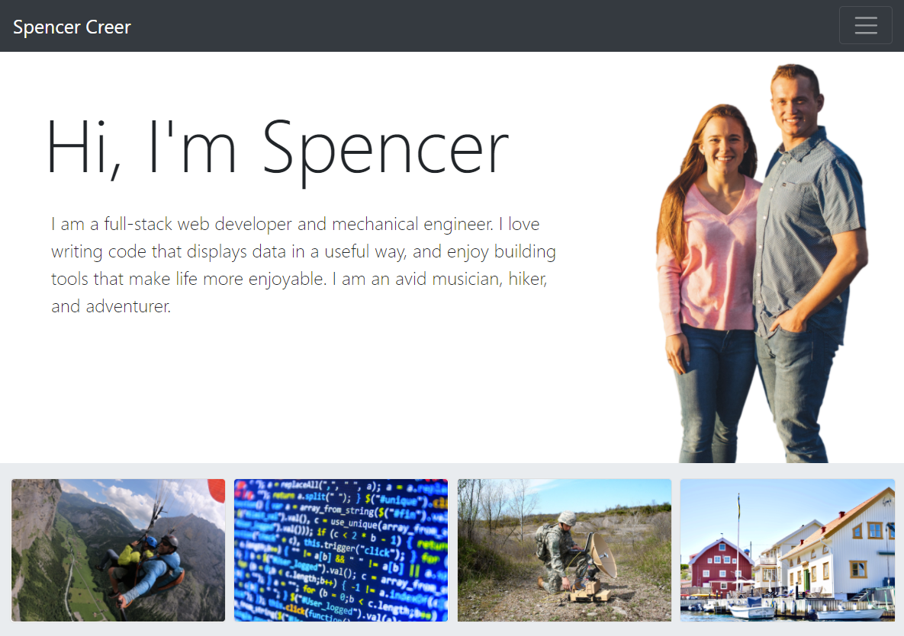
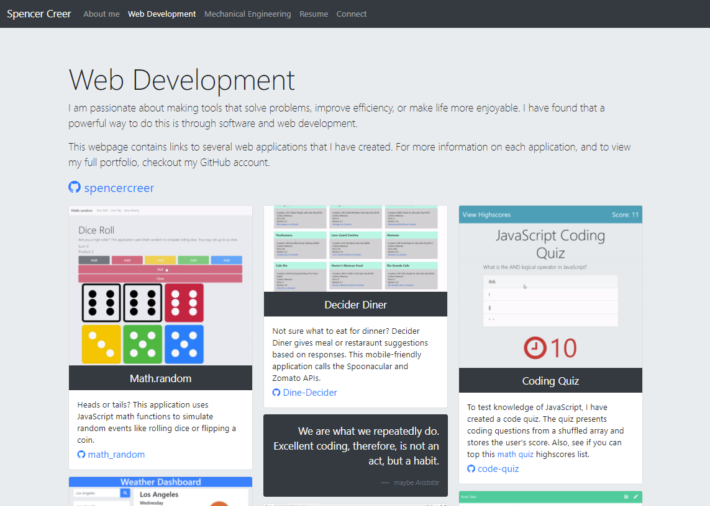
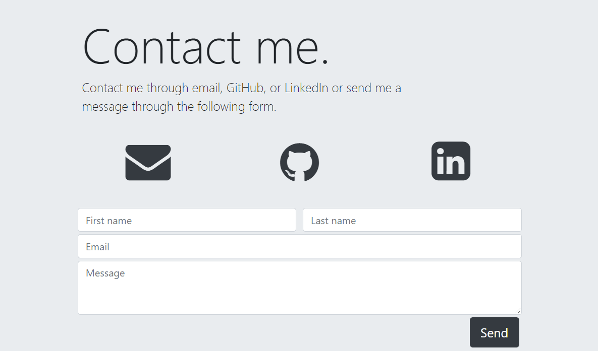

# Full-Stack Portfolio


## Description
This portfolio web application contains home, biography, portfolio, and resume web pages. The home page contains a React contact form. The application uses bootstrap CSS framework to create a mobile first, responsive layout and responsive images.

## Table of Contents
* [Links](#links)
* [Images](#images)  
* [Technologies](#technologies)  
* [License](#license)
* [Contact](#contact)

## Links
Published URL: [https://spencercreer.github.io/portfolio/](https://spencercreer.github.io/portfolio/)

Repository: [https://github.com/spencercreer/portfolio](https://github.com/spencercreer/portfolio)

## Images

Home page: 
</br>
 

Portfolio page: 
</br>


Contact form: 
</br>
 

## Technologies
 * HTML
 * CSS
 * Bootstrap

## Installation
```bash
npm install
npm install react-bootstrap bootstrap
```

## License
This project is licensed under the MIT license.
## Contact
For questions or comments, please contact me.

Email: <a href="mailto: spencercreer@gmail.com" target="_blank">spencercreer@gmail.com</a>

GitHub: [spencercreer](https://github.com/spencercreer/)
